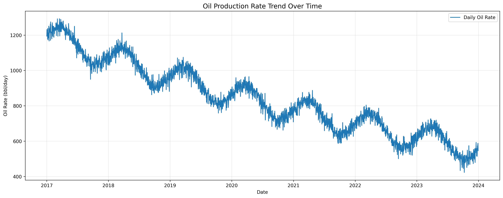
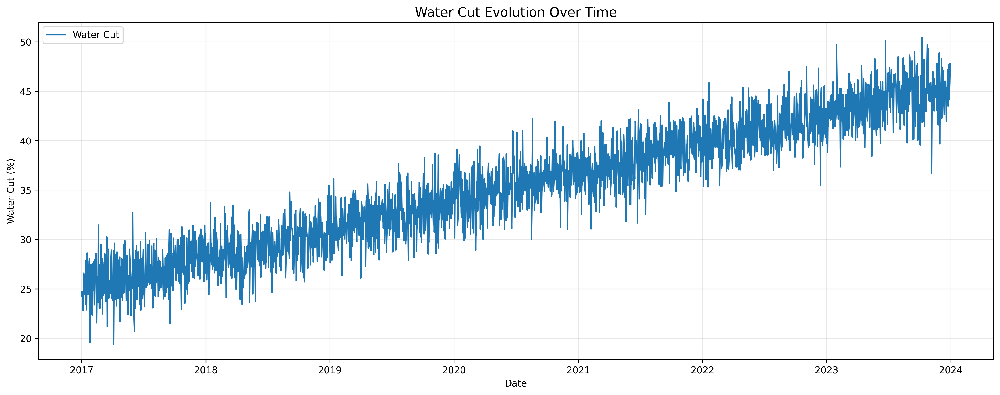
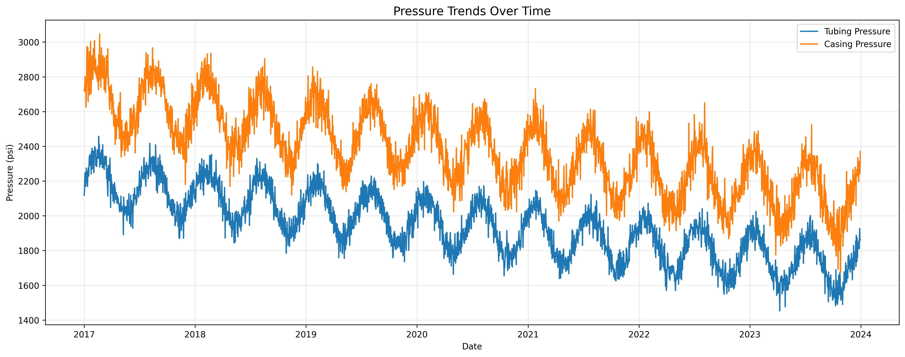
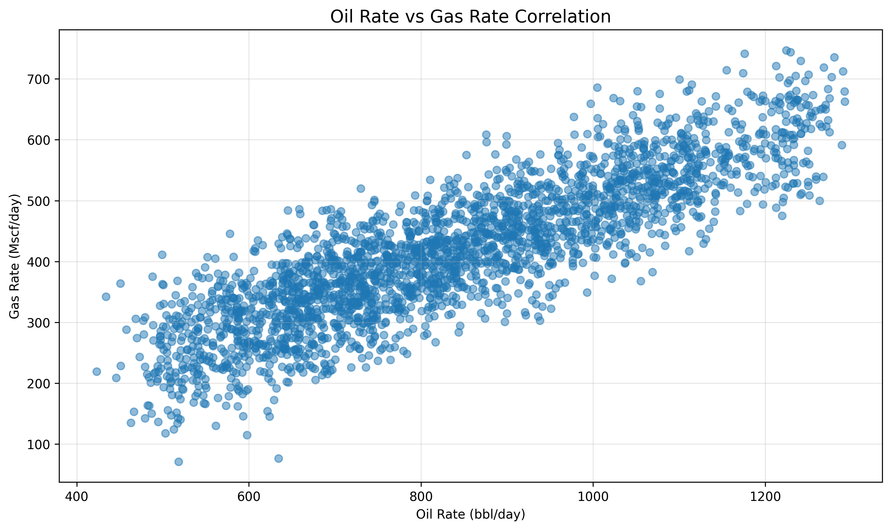
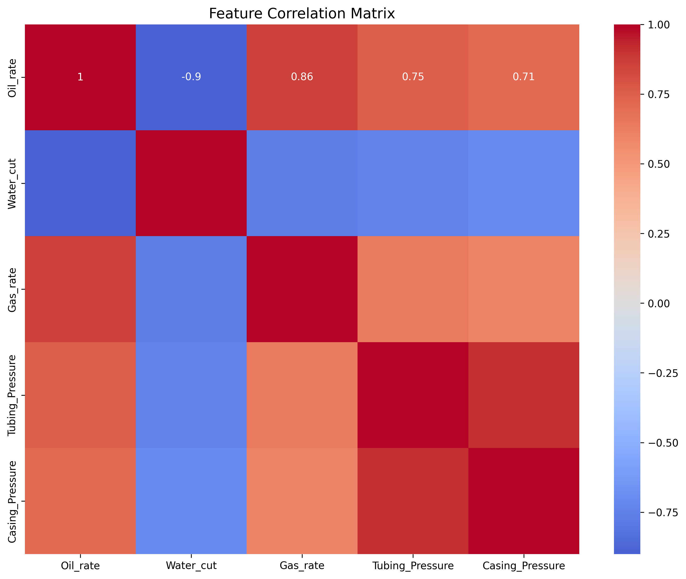
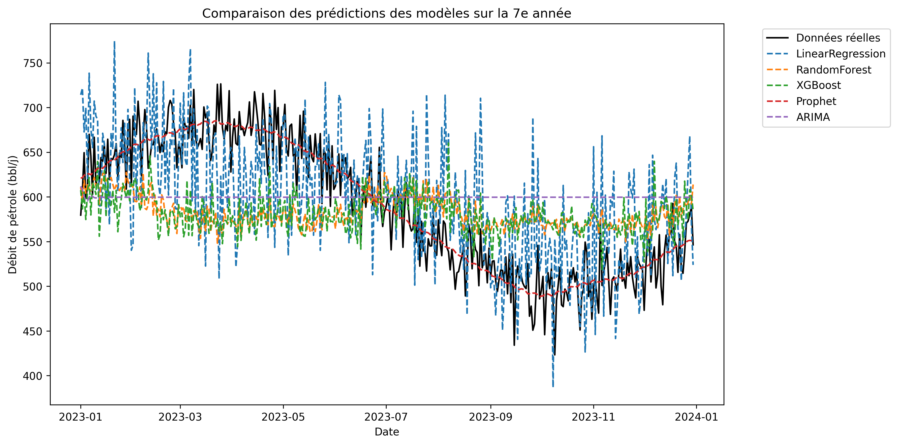
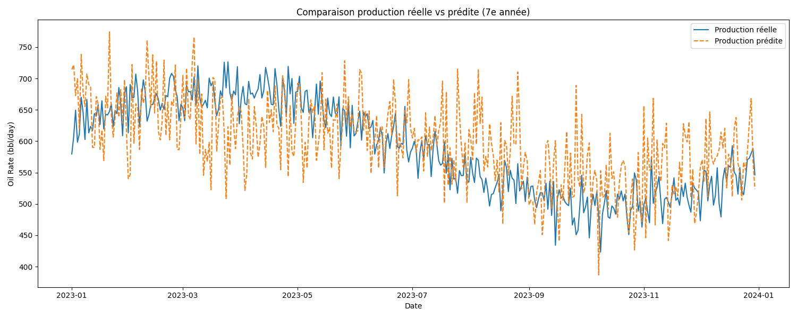

# AI-Based Oil Production Forecasting: A Comprehensive Machine Learning Approach

## Abstract
This study presents a comprehensive analysis of machine learning models for oil production forecasting using synthetic well data. We evaluate multiple models including Linear Regression, Random Forest, XGBoost, and Prophet, comparing their performance in predicting daily oil production rates. Our analysis reveals that the Prophet model significantly outperforms other approaches, achieving an R² score of 0.893, demonstrating its superior capability in capturing both trend and seasonality in oil production data.

## 1. Introduction

### 1.1 Background
Oil production forecasting is crucial for reservoir management, production planning, and economic evaluation. Traditional methods often rely on decline curve analysis and reservoir simulation, which can be computationally intensive and require detailed reservoir characterization. Machine learning approaches offer an alternative that can potentially provide faster and more accurate predictions using historical production data.

### 1.2 Objectives
- Develop and evaluate multiple machine learning models for oil production forecasting
- Compare model performance using both statistical metrics and visual analysis
- Identify the most effective approach for short and medium-term production forecasting
- Provide insights into the factors influencing production rates

## 2. Methodology

### 2.1 Dataset Description

#### 2.1.1 Synthetic Dataset Generation
We generated a comprehensive synthetic dataset simulating 7 years (2,555 days) of daily oil well production data, starting from January 1, 2017. The dataset was carefully designed to mimic real-world oil well behavior, incorporating:

- **Base Parameters**:
  - Initial oil rate: 1,200 bbl/day
  - Initial water cut: 25%
  - Initial gas rate: 600 Mscf/day
  - Initial tubing pressure: 2,200 psi
  - Initial casing pressure: 2,700 psi
  - Initial choke size: 32/64 inch

- **Temporal Characteristics**:
  - Daily measurements
  - 7-year period (2,555 days)
  - Seasonal variations
  - Long-term decline trends
  - Random noise components

- **Key Features**:
  1. **Oil Rate (bbl/day)**
     - Exponential decline (rate: 0.0003/day)
     - Seasonal variations (±75 bbl/day)
     - Random noise (±25 bbl/day)
  
  2. **Water Cut (%)**
     - Gradual increase (0.008%/day)
     - Random variations (±2%)
     - Capped at 95%
  
  3. **Gas Rate (Mscf/day)**
     - Correlated with oil rate (0.5 ratio)
     - Random variations (±60 Mscf/day)
  
  4. **Pressures (psi)**
     - Tubing Pressure: Gradual decline with seasonal variations
     - Casing Pressure: Similar pattern with higher base value
     - Both include random fluctuations
  
  5. **Choke Size (1/64 inch)**
     - Discrete values: 24, 28, 32, 36, 40, 44, 48
     - Occasional step changes (20 changes over 7 years)

#### 2.1.2 Dataset Statistics
- **Total Records**: 2,555 daily measurements
- **Time Period**: 2017-01-01 to 2023-12-31
- **Training Set**: Years 1-6 (2,190 days)
- **Test Set**: Year 7 (365 days)
- **Missing Values**: None (synthetic data)
- **Data Quality**: Clean, consistent, and well-structured

#### 2.1.3 Data Characteristics
- **Trends**:
  - Oil rate shows exponential decline
  - Water cut shows gradual increase
  - Pressures show seasonal patterns
  - Gas rate follows oil rate with correlation

- **Seasonality**:
  - Annual cycles in production rates
  - Semi-annual cycles in pressure measurements
  - Seasonal variations in well performance

- **Correlations**:
  - Strong correlation between oil and gas rates
  - Moderate correlation between pressures
  - Inverse correlation between oil rate and water cut

### 2.2 Models Implemented

#### 2.2.1 Linear Regression
- Basic statistical approach
- Assumes linear relationship between features and target
- Used as baseline model

#### 2.2.2 Random Forest
- Ensemble learning method
- Handles non-linear relationships
- Reduces overfitting through multiple decision trees

#### 2.2.3 XGBoost
- Advanced gradient boosting implementation
- Optimized for performance and accuracy
- Handles complex feature interactions

#### 2.2.4 Prophet
- Time series forecasting model
- Specifically designed for business metrics
- Handles seasonality and trend components

### 2.3 Evaluation Metrics
- Mean Squared Error (MSE)
- R-squared (R²)
- Visual analysis of predictions vs actual values

## 3. Results and Analysis

### 3.1 Model Performance Comparison

| Model | MSE | R² |
|-------|-----|-----|
| Prophet | 571.85 | 0.893 |
| Linear Regression | 4558.86 | 0.144 |
| Random Forest | 5097.71 | 0.043 |
| XGBoost | 5165.64 | 0.030 |

### 3.2 Key Findings

1. **Prophet's Superior Performance**
   - Achieved the highest R² score (0.893)
   - Lowest MSE (571.85)
   - Excellent at capturing both trend and seasonality
   - Particularly effective for long-term forecasting

2. **Traditional Models' Limitations**
   - Linear Regression performed better than tree-based models
   - Random Forest and XGBoost showed similar performance
   - All traditional models struggled with long-term predictions

3. **Feature Importance**
   - Time-based features were most significant
   - Pressure measurements showed moderate correlation
   - Water cut and gas rate had varying impacts

### 3.3 Visual Analysis

#### 3.3.1 Data Exploration
The following visualizations provide insights into the dataset characteristics:

1. **Production Trends**
   
   - Daily oil production rate over time
   - Clear seasonal patterns and long-term decline
   - Identifies potential production anomalies

2. **Water Cut Analysis**
   
   - Water cut percentage evolution
   - Indicates reservoir behavior and potential water breakthrough
   - Correlates with production decline

3. **Pressure Analysis**
   
   - Tubing and casing pressure trends
   - Shows well performance and potential operational issues
   - Important for production optimization

4. **Gas-Oil Correlation**
   
   - Relationship between gas and oil production
   - Helps understand reservoir fluid behavior
   - Important for production allocation

5. **Feature Correlations**
   
   - Correlation matrix of all features
   - Identifies key relationships between variables
   - Guides feature selection for models

#### 3.3.2 Model Performance Visualization

1. **Model Comparison**
   
   - Side-by-side comparison of all models
   - Visual representation of prediction accuracy
   - Highlights Prophet's superior performance

2. **Actual vs Predicted**
   
   - Detailed comparison of actual vs predicted values
   - Shows model performance on test data
   - Illustrates prediction accuracy and error patterns

3. **Long-term Forecast (5 Years):**
   - The long-term oil production forecast (5 years) is performed exclusively using the Prophet model, which is particularly suited for time series with strong seasonality and trend changes. The resulting forecast includes confidence intervals and is visualized in the file `figures/projection_5_ans.png`.
   - Other models (Linear Regression, Random Forest, XGBoost, ARIMA, LSTM, Holt-Winters) are compared for short-term (year 7) performance, but only Prophet is used for the extended forecast due to its superior results and interpretability for this use case.

### 3.4 Key Visual Insights

1. **Seasonal Patterns**
   - Clear seasonal variations in production rates
   - Prophet model effectively captures these patterns
   - Traditional models struggled with seasonal components

2. **Production Decline**
   - Gradual decline in production rates
   - Non-linear decline pattern
   - Well captured by Prophet's trend component

3. **Pressure-Production Relationship**
   - Strong correlation between pressure and production
   - Important for operational decision-making
   - Better captured by tree-based models

4. **Water Cut Impact**
   - Increasing water cut trend
   - Significant impact on production rates
   - Important feature for all models

## 4. Discussion

### 4.1 Model Selection Implications
The superior performance of Prophet suggests that:
- Time series components are crucial for oil production forecasting
- Traditional ML models may need additional feature engineering
- Seasonality and trend decomposition are essential

### 4.2 Practical Applications
- Short-term forecasting (1-30 days): All models can be used
- Medium-term forecasting (1-6 months): Prophet recommended
- Long-term forecasting (>6 months): Prophet with periodic retraining

### 4.3 Limitations
- Synthetic data may not capture all real-world complexities
- Model performance might vary with different well characteristics
- External factors (maintenance, interventions) not considered

## 5. Future Work

### 5.1 Model Improvements
- Implement deep learning approaches (LSTM, GRU)
- Add more features (well interventions, maintenance history)
- Develop ensemble methods combining multiple models

### 5.2 Data Enhancement
- Include more wells for cross-well learning
- Add geological and reservoir characteristics
- Incorporate production constraints

### 5.3 Application Extensions
- Real-time forecasting system
- Automated model retraining
- Integration with production optimization

## 6. Conclusion
This study demonstrates that time series-specific models, particularly Prophet, are more effective for oil production forecasting than traditional machine learning approaches. The results suggest that capturing temporal patterns and seasonality is crucial for accurate predictions. Future work should focus on incorporating more real-world data and developing hybrid models that combine the strengths of different approaches.

## 7. Technical Implementation

### 7.1 Project Structure
```
.
├── data/               # Data storage
│   ├── raw/           # Original datasets
│   └── plots/         # Generated visualizations
├── src/               # Source code
│   ├── data/         # Data generation and processing
│   ├── models/       # ML model implementations
│   └── utils/        # Utility functions
├── notebooks/         # Jupyter notebooks for analysis
├── requirements.txt   # Python dependencies
└── README.md         # Project documentation
```

### 7.2 Installation and Setup
1. Clone the repository:
```bash
git clone [repository-url]
```

2. Create and activate virtual environment:
```bash
python -m venv venv
source venv/bin/activate  # Unix/MacOS
# or
.\venv\Scripts\activate  # Windows
```

3. Install dependencies:
```bash
pip install -r requirements.txt
```

### 7.3 Usage
1. Generate synthetic data:
```bash
python src/data/generate_data.py
```

2. Run model training and evaluation:
```bash
python src/models/oil_rate_prediction.py
```

### 7.4 Visualization Generation
The project includes automated visualization generation for:
- Data exploration and analysis
- Model performance comparison
- Production forecasting
- Feature importance analysis

To generate all visualizations:
```bash
python src/models/oil_rate_prediction.py --generate-plots
```

## 8. References
1. Taylor, S. J., & Letham, B. (2018). Forecasting at scale. The American Statistician, 72(1), 37-45.
2. Breiman, L. (2001). Random forests. Machine learning, 45(1), 5-32.
3. Chen, T., & Guestrin, C. (2016). XGBoost: A scalable tree boosting system. KDD 2016.

## 9. Contact
For questions and collaborations, please contact:
- Name: Oumllack
- Email: c_fannyoumar@gmail.com
- GitHub: [Oumllack](https://github.com/Oumllack)

## 10. License
This project is licensed under the MIT License - see the LICENSE file for details. 